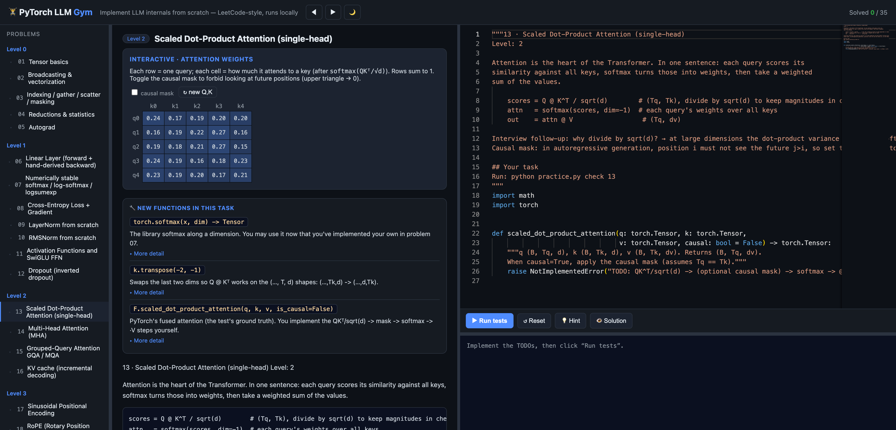

# PyTorch LLM Gym 🏋️

**Implement the internals of modern LLMs from scratch — LeetCode-style, runs on your own machine.**


A progressive set of 35 hands-on PyTorch exercises that take you from tensor basics all the way to
Transformers, sampling, and multimodal components (ViT / CLIP / LLaVA). Each problem gives you a
description, a code skeleton with `TODO`s, and a test suite — you fill in the code and get instant
pass/fail feedback. Built for interview prep and for anyone who wants to *actually* understand how
LLMs work by building them.



There are two ways to use it: a **browser app** (recommended) and a **CLI**.

---

## 🌐 Web app (recommended)

A local, zero-build web UI: write code in the browser, hit **Run**, and it executes the real `pytest`
on your machine. The editor is **Monaco** (the engine behind VS Code) — syntax highlighting,
PyTorch-aware autocomplete, and live Python syntax checking (real CPython, via the backend). Comes
with **interactive, graphical explanations** (drag a slider to see how temperature reshapes a
softmax; toggle a causal mask on an attention heatmap; hover a Transformer block diagram).

```bash
pip install -r requirements.txt      # torch + pytest
python web/app.py                    # opens http://127.0.0.1:8000
```

No Node, no npm, no extra Python packages — just the standard library serving a single-page app.

> Your code runs locally and never leaves your machine. (A hosted version would require sandboxing —
> see the roadmap.)

---

## ⌨️ CLI (no browser)

```bash
python practice.py            # show progress + jump to the next problem
python practice.py list       # list all problems and their status
python practice.py show 13    # print a problem statement
```

Open `exercises/<id>_<name>/task.py`, replace the `raise NotImplementedError` with your implementation,
then:

```bash
python practice.py check 13      # run that problem's tests
python practice.py hint 13       # progressive hints
python practice.py solution 13   # reference solution (try it yourself first!)
```

---

## Curriculum (35 problems, Level 0 → 6)

See [ROADMAP.md](ROADMAP.md) for the full list.

| Level | Topic | Keywords |
|---|---|---|
| 0 | Tensor & PyTorch basics | shape / broadcasting / gather / autograd |
| 1 | Core NN building blocks | Linear / softmax / cross-entropy / LayerNorm / RMSNorm / SwiGLU |
| 2 | Attention | scaled dot-product / multi-head / GQA / KV cache |
| 3 | Positional encoding & Transformer | sinusoidal / RoPE / full GPT decoder |
| 4 | Training & generation | training loop / sampling (top-k/top-p) / LR schedule / beam search |
| 5 | Advanced LLM | AdamW / MoE / LoRA / flash-attention / speculative decoding / DPO |
| 6 | **Multimodal** | ViT patchify / CLIP / LLaVA projector / cross-attention / 2D-RoPE |

Every reference solution is verified against its own test suite, and the tests check real properties —
e.g. *KV-cache incremental decoding equals one-shot causal attention*, *RoPE makes scores depend only
on relative position*, *speculative decoding's output distribution equals the target* (Monte-Carlo
checked), *your AdamW matches `torch.optim.AdamW`*.

---

## How it's organized

```
exercises/<id>_<name>/task.py   # the file you edit (problem statement in the docstring + TODOs)
exercises/<id>_<name>/test.py   # pytest tests
solutions/<id>_<name>.py        # HINTS list + reference solution
web/                            # the local web app (stdlib server + static frontend + explainers)
practice.py                     # the CLI runner
```

Adding a new problem = drop in a `task.py` + `test.py` + a solution file; it shows up in both the CLI
and the web app automatically. Optional interactive explainers live in `web/explainers/<id>_<name>.html`.

## Tips

1. **A few problems a day.** Repetition beats raw progress — manual coding is muscle memory.
2. **Read the failure output.** Understanding pytest errors is itself an interview skill.
3. After finishing a level, try to **rewrite a couple of problems from memory** — interviews are live coding.

Requirements: Python 3.9+, `pip install -r requirements.txt`.
